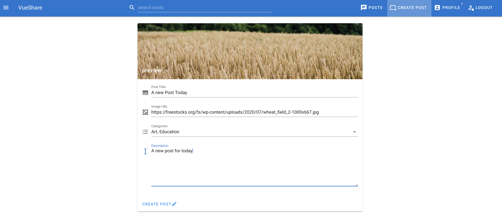
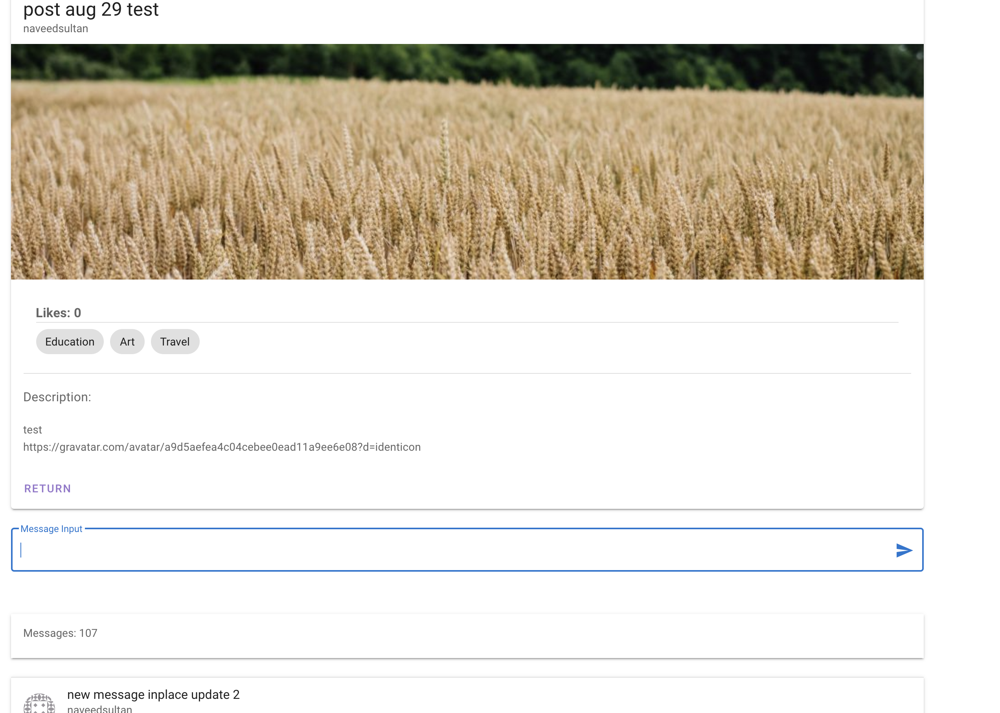

# fullstack-vue-post-sharing-WebApp

## Tools: Node JS, Express Server, Mongodb, Apollo Graphql API, JsonWebToken and Vue front end frame work integration

# client + Server

## project Clone
```
git clone https://github.com/naveed1224/fullstack-vue-post-sharing-WebApp
```

## Project setup
```
npm install
```

### Compiles and hot-reloads for development
```
npm run dev
```

### Customize configuration
See [Configuration Reference](https://cli.vuejs.org/config/).

## pictures:






